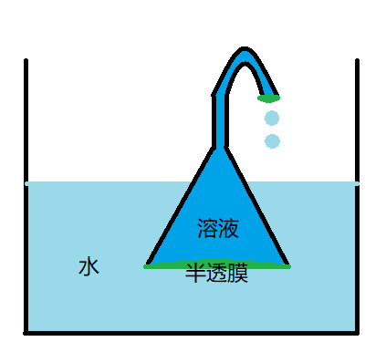

# 逆耗散半透膜热机验证实验的简要实验方案
以下是一个设计逆耗散半透膜热机验证实验的简要实验方案，附带实验准备、预实验、实验步骤、可能的实验结果和实验装置图。

## 实验简介
本实验旨在验证逆耗散半透膜热机的工作原理和性能。逆耗散半透膜热机是一种通过半透膜中的质量传递来实现热机效应的装置，其能够从低温热源吸收热量，并将部分热量转化为机械功。

## 实验准备
- 逆耗散半透膜热机样品
- 温度计
- 漏斗
- 实验槽或容器
- 半透膜
- 支架
- 数据采集仪器

## 预实验
在正式进行实验之前，进行以下预实验以了解逆耗散半透膜热机的工作特性：
1. 测量逆耗散半透膜热机的液面高度差和不同溶质浓度的关系。
2. 测量逆耗散半透膜热机的液面高度差和温度的关系。

## 实验步骤
1. 将逆耗散半透膜热机安装在实验槽或容器中，确保其处于密封状态，并通过数据采集仪器连接以记录实验数据。
2. 准备热源和冷源，调节其温度分别为高温TH和低温TL。
3. 将逆耗散半透膜热机的热端连接到热源，冷端连接到冷源。
4. 开始记录实验数据，包括热端温度TH、冷端温度TL、压力差ΔP等。
5. 逐渐调节热源和冷源的温度差，记录对应的实验数据，同时观察逆耗散半透膜热机的性能变化。
6. 在不同温度差下重复步骤4-5，直到获得足够的数据。
7. 在实验过程中，逐渐增加热源和冷源的温度差，以获得不同的工作条件。记录每个温度差下的热端温度TH、冷端温度TL和压力差ΔP。
8. 根据记录的数据，计算逆耗散半透膜热机的传热速率和效率。

## 可能的实验结果
实验结果将提供有关逆耗散半透膜热机的工作特性和性能的数据，包括：
- 逆耗散半透膜热机的传热速率随温度差的变化曲线。
- 逆耗散半透膜热机的效率随温度差的变化曲线。
- 逆耗散半透膜热机的最佳工作温度差。
- 逆耗散半透膜热机的传热速率随温度差的变化曲线。观察传热速率是否随着温度差的增加而增加，或者是否存在一个最佳温度差来实现最大传热速率。
- 逆耗散半透膜热机的效率随温度差的变化曲线。观察效率是否随着温度差的增加而增加，或者是否存在一个最佳温度差来实现最大效率。
- 逆耗散半透膜热机的最佳工作温度差。根据实验数据计算出逆耗散半透膜热机的最佳工作温度差，以获得最大的传热速率和效率。
  
## 实验装置图

请注意，这只是一个简要设计，实际实验中可能需要更多的考虑和细节。请确保在实验过程中遵循安全操作规程，并根据实验需求可能需要进行调整和改进实验步骤。实验结果将有助于进一步了解逆耗散半透膜热机的特性和性能。
